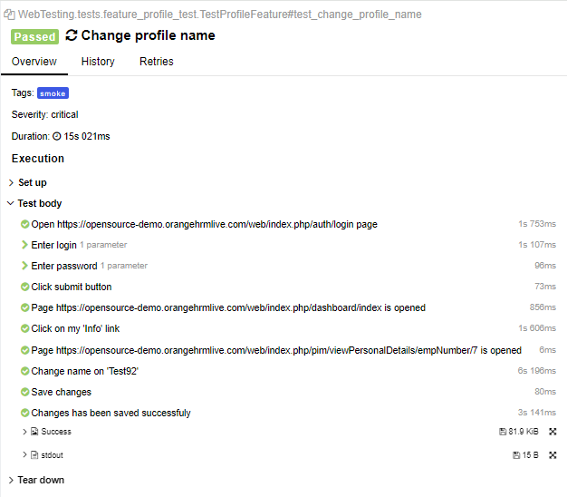

# WebTesting Project


[](https://pypi.org/project/pytest/7.3.2)
[](https://pypi.org/project/selenium/4.6.0/)
[](https://pypi.org/project/allure-pytest/) [](https://docs.docker.com/desktop/install/windows-install/)


**WebTesting Project** - This module focuses on testing the interface components of [web application](https://opensource-demo.orangehrmlive.com/auth/login) using Pytest, Selenium, and Allure, Docker and Github Actions

## Download and setup

### Via pytest in console

1. Clone this repository to your local directory:
```
git clone https://github.com/Kostya-59benz/webtest_app
```

2. Create a virtual environment:
```
python -m venv venv
```
3. Activate virtual environment:
    
    * On Windows 
    ```
    venv\Scripts\activate
    ```
    * On macOS/Linux
    ```
    source venv/bin/activate
    ```

4. Install requirements:
    ```
    pip install -r requirements.txt
    ```
5. Print 'pytest' in console: 
    ```
    pytest
    ```

### Via Docker

1. Run docker compose:
    ```
    docker-compose up
    ```

## Result

1. Auto login

2. Open login page

3. Click 'My Info' - link

4. Change name

5. Creating report with Allure
   
6. Use github actions
   

# Allure report





